# Architecture Diagrams (Mermaid)

## System Architecture Overview

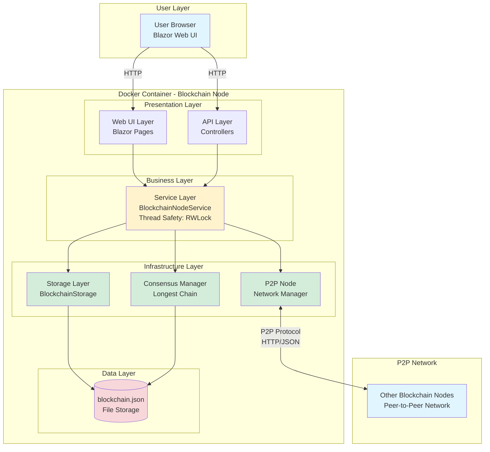

## Component Architecture

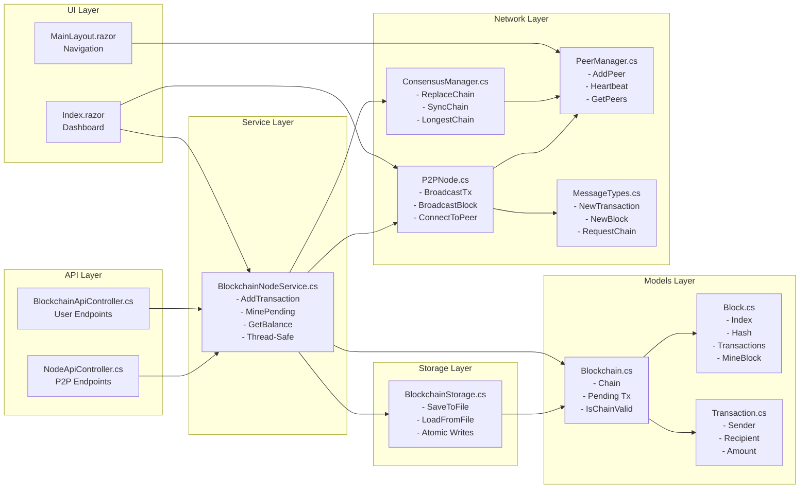

## Transaction Flow

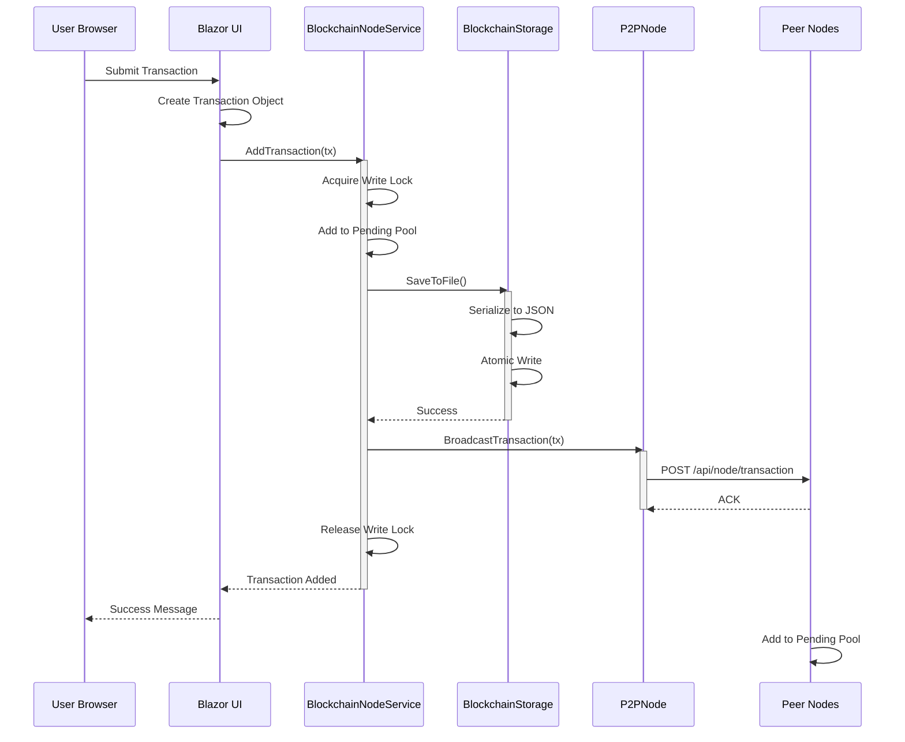

## Mining Flow

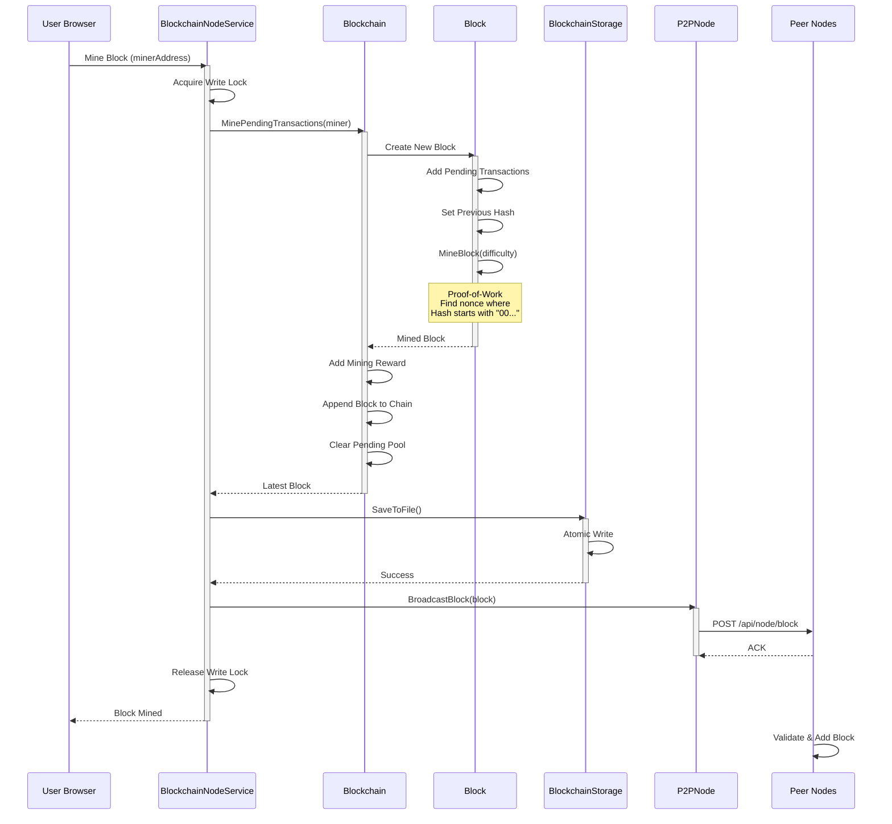

## Consensus Synchronization Flow

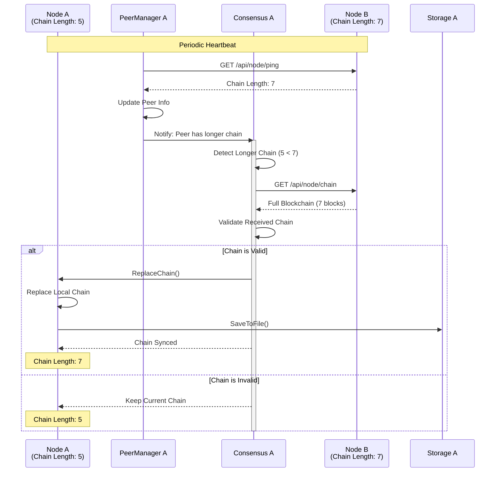

## P2P Network Topology

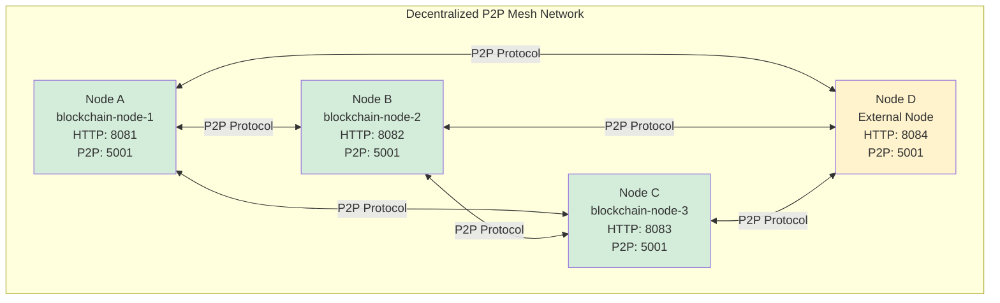

## Peer Discovery Flow

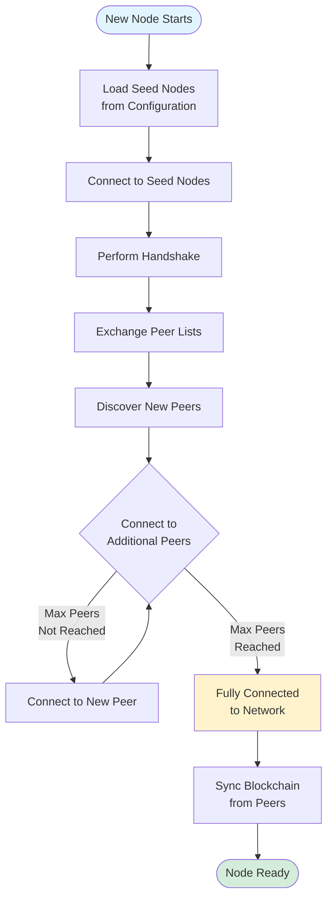

## Docker Multi-Node Architecture

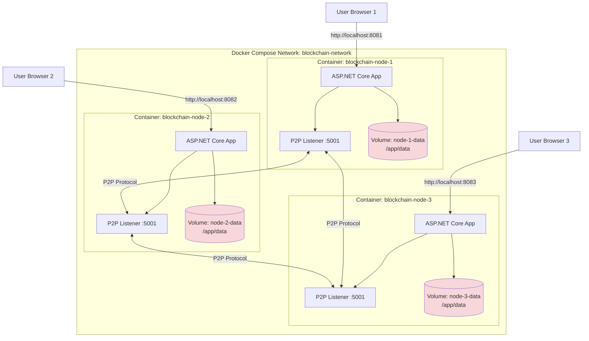

## Data Flow: Complete Transaction Lifecycle

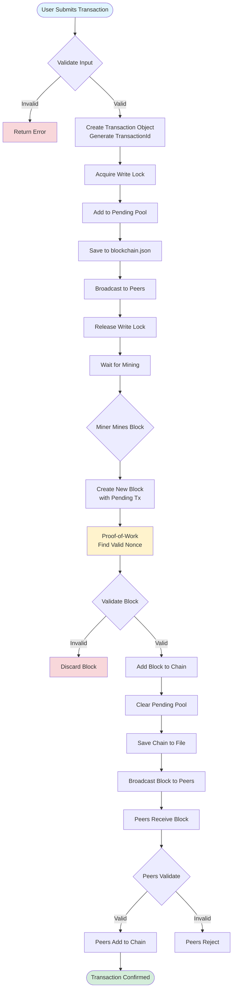

## Thread Safety Architecture

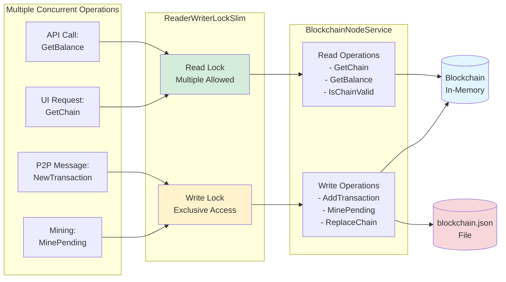

## Storage Architecture

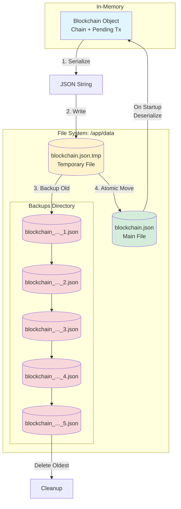

## API Endpoint Architecture

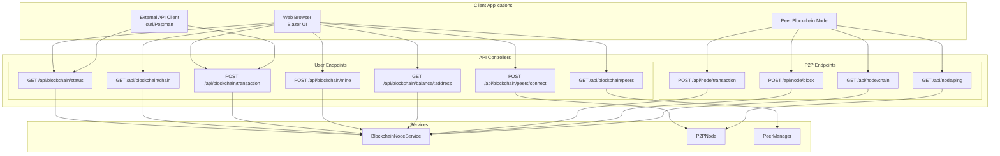

## Consensus: Longest Chain Rule

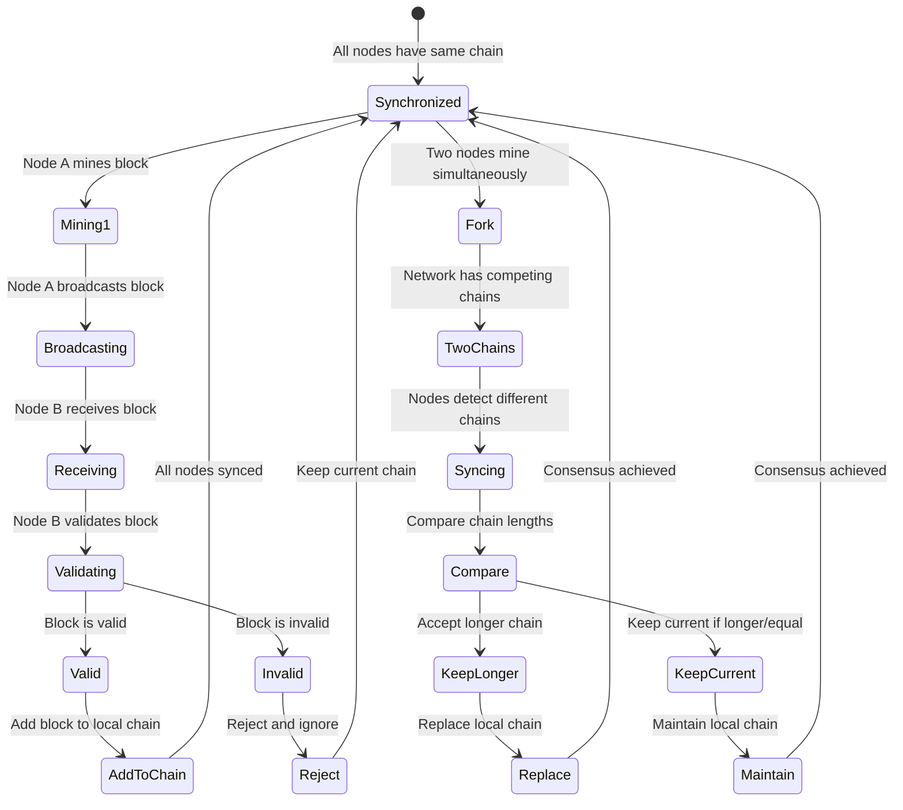

## Block Mining State Machine

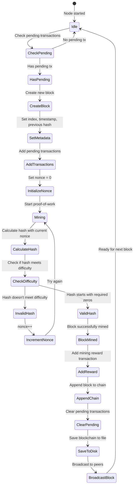

## Message Flow: Block Propagation

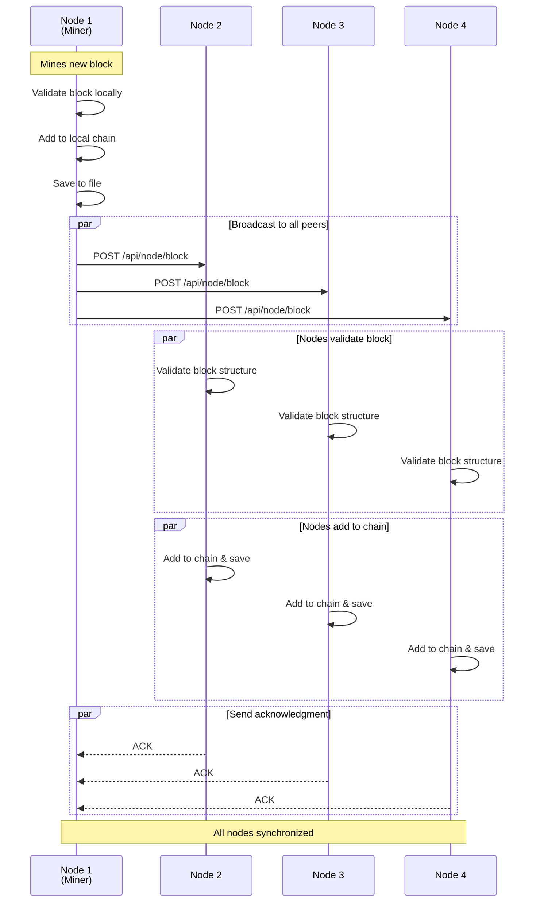

## Deployment Architecture (Cloud)

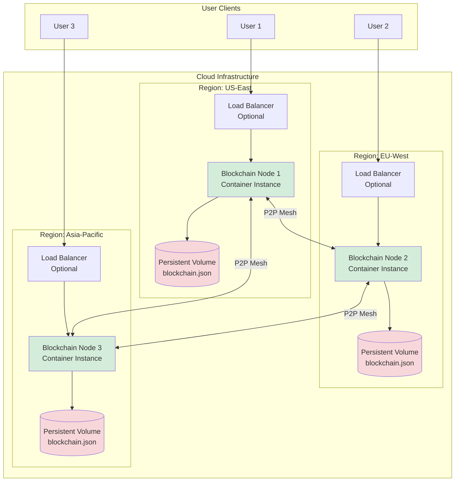

## Application Startup Flow

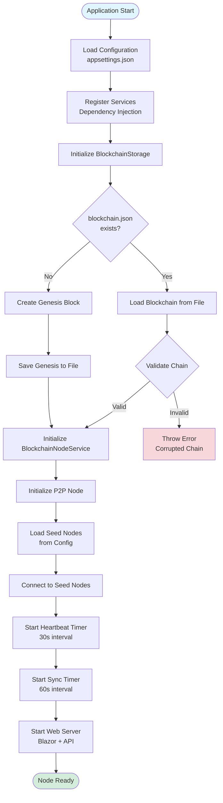

